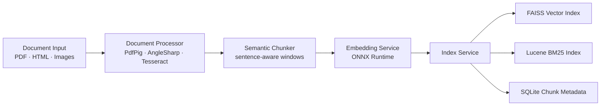

# PyRagix.Net

PyRagix.Net is a local-first, educational Retrieval-Augmented Generation (RAG) project for .NET 9.0. It mirrors the Python reference implementation while showcasing how to compose modern retrieval techniques in C#. Query expansion, hybrid search (semantic + keyword), cross-encoder reranking, and Ollama-backed generation all run locally so you can study the full pipeline without depending on hosted services.


> [!IMPORTANT]
> Treat this repository as a learning lab and reference implementation. The focus is readability, strict typing, and transparent configuration—not a turnkey “enterprise” deployment.

## Overview

PyRagix.Net ships as a class library plus console sample so you can explore ingestion and querying patterns from a C# environment. Everything runs on your infrastructure with zero external API dependencies for document processing and search.

**Key Highlights:**
- **Privacy-First**: All document processing, indexing, and search happen locally.
- **Educational Focus**: Modules are organized so each pipeline stage is easy to inspect.
- **Developer-Friendly**: Simple C# API with comprehensive configuration options.
- **Cross-Platform**: Runs on Windows, Linux, and macOS via .NET 9.0.

This repository contains:
- **`pyragix-net/`** - The RAG engine class library (see the engine [`README`](pyragix-net/README.md))
- **`pyragix-net-console/`** - Console application demonstrating engine usage

### Technology at a Glance
Talking with stakeholders or curious users? This is the quick translation guide:
- **RAG** – An “open-book” AI that looks up relevant docs before answering.
- **Hybrid Search (FAISS + BM25)** – Semantic matchmaker plus keyword detective.
- **Ollama** – Runs the local LLM for query rewrites and answer drafting.
- **ONNX Runtime** – Keeps exported ML models humming inside .NET.
- **Tesseract OCR** – Turns scanned PDFs into searchable text.

Need more than bullet points? See our [`technology explainer`](docs/technology-explainer.md) for a deeper plain-language tour.

## Quick Start

### Prerequisites

1. **.NET 9.0 SDK** - [Download here](https://dotnet.microsoft.com/download/dotnet/9.0)
2. **Ollama** - [Download here](https://ollama.com) for local LLM inference
3. **Python 3.8+** - For one-time ONNX model export
4. **8GB+ RAM** (16GB+ recommended for optimal performance)

### Installation

```bash
# Clone repository
git clone https://github.com/psarno/pyragix-net.git
cd pyragix-net

# Restore NuGet packages
dotnet restore

# Build solution
dotnet build

# Run unit tests (xUnit)
dotnet test
```

For test-writing guidance, see [`PyRagix.Net.Tests/README.md`](PyRagix.Net.Tests/README.md).

### Setup ONNX Models (One-Time)

PyRagix.Net requires two ONNX models for embeddings and reranking. Export from Python:

```bash
# Install export tool
pip install optimum[exporters-onnx]

# Export embedding model (sentence-transformers)
optimum-cli export onnx \
  --model sentence-transformers/all-MiniLM-L6-v2 \
  --task feature-extraction \
  pyragix-net/Models/embeddings

# Export reranker model (cross-encoder)
optimum-cli export onnx \
  --model cross-encoder/ms-marco-MiniLM-L-6-v2 \
  --task text-classification \
  pyragix-net/Models/reranker
```

See [`docs/ONNX_SETUP.md`](docs/ONNX_SETUP.md) for detailed instructions.

### Configure and Run

```bash
# Copy example configuration
cp pyragix-net-console/settings.example.toml pyragix-net-console/settings.toml

# Start Ollama server (in separate terminal)
ollama pull qwen2.5:7b
ollama serve

# Run console app
cd pyragix-net-console

# Ingest documents (append --fresh to rebuild indexes from scratch)
dotnet run -- ingest ./docs

# Query the RAG system
dotnet run -- query "What is retrieval-augmented generation?"
```

### Vector Index Backends (Windows vs. Linux/WSL)

PyRagix.Net selects the vector index implementation automatically:

- **Windows (native)** – Uses [FaissNet](https://www.nuget.org/packages/FaissNet) with the FAISS C++ backend for best performance.
- **Linux / macOS / WSL** – Uses the built-in managed inner-product index (no native dependencies). This keeps the project runnable when FAISS binaries are unavailable.

When switching operating systems (e.g., migrating from Windows to WSL), delete previously generated vector artifacts before re-ingesting:

```bash
rm -f faiss_index.bin
rm -f pyragix.db
rm -rf lucene_index
```

Then rerun ingestion inside the target environment so the index is regenerated in the correct format. You can also run `dotnet run -- ingest ./docs --fresh` to let the CLI handle cleanup before rebuilding.

## Usage

### As a Library

The primary use case is integrating PyRagix.Net as a library in your C# applications:

```csharp
using PyRagix.Net.Core;
using PyRagix.Net.Config;

// Load configuration from TOML file
var engine = RagEngine.FromSettings("settings.toml");

// Or configure programmatically
var config = new PyRagixConfig
{
    OllamaEndpoint = "http://localhost:11434",
    OllamaModel = "qwen2.5:7b",
    EmbeddingModelPath = "./pyragix-net/Models/embeddings/model.onnx",
    RerankerModelPath = "./pyragix-net/Models/reranker/model.onnx",
    EnableQueryExpansion = true,
    EnableHybridSearch = true,
    EnableReranking = true
};
var engine = new RagEngine(config);

// Ingest documents (PDF, HTML, images). Set fresh: true to recreate indexes from scratch.
await engine.IngestDocumentsAsync("./my-documents", fresh: false);

// Query with natural language
var answer = await engine.QueryAsync("What are the key findings?");
Console.WriteLine(answer);
```

### Console Application

The included console app (`pyragix-net-console/`) demonstrates basic usage:

```bash
# Ingest a folder of documents (append --fresh to purge existing indexes)
dotnet run -- ingest <folder_path>

# Query the indexed documents
dotnet run -- query "<your question>"
```

Passing `--fresh` (or `-f`) to the ingest command clears FAISS, Lucene, and SQLite artifacts before rebuilding.

## Architecture

PyRagix.Net implements a multi-stage retrieval pipeline optimized for accuracy and privacy.

### Query Pipeline

```
User Query
  ↓
Multi-Query Expansion (3-5 variants via local LLM)
  ↓
Hybrid Search (FAISS semantic 70% + Lucene BM25 keyword 30%)
  ↓
Cross-Encoder Reranking (top-20 → top-7 by relevance)
  ↓
Answer Generation (local Ollama LLM)
```

```mermaid
flowchart LR
    Q[User Question] --> QE[Query Expander<br/>(LLM variants)]
    QE --> EMB[Embedding Service<br/>ONNX Runtime]
    EMB --> HR[Hybrid Retriever<br/>reciprocal rank fusion]
    FAISS[FAISS Vector Index] --> HR
    LUCENE[Lucene BM25 Index] --> HR
    HR --> RR[Cross-Encoder Reranker]
    RR --> GEN[Ollama Generator]
    GEN --> A[Final Answer]
```

### Ingestion Pipeline

```
Document Input (PDF, HTML, Images)
  ↓
Text Extraction (PdfPig, AngleSharp, Tesseract OCR)
  ↓
Semantic Chunking (sentence-boundary aware)
  ↓
Embedding Generation (ONNX Runtime - CPU/GPU)
  ↓
Dual Indexing (FAISS vector + Lucene BM25 keyword)
  ↓
SQLite Metadata Storage
```



**Performance Benefits:**
- Query expansion: 20-30% improved recall
- Cross-encoder reranking: 15-25% better precision
- Hybrid search: 30-40% better structured query handling

## Key Features

### Learning-Focused Design

- **Traceable Pipelines**: Ingestion, retrieval, and orchestration live in separate namespaces so you can follow each step.
- **Strict Typing as Documentation**: Nullable reference types and explicit models make contracts obvious.
- **Configurable Experiments**: Toggle query expansion, reranking, and hybrid search independently to observe impact.
- **Local-Only Stack**: Reproduce workshops or internal trainings without cloud dependencies or API quotas.

### Modern RAG Techniques

- **Query Expansion**: Generates multiple query variants to capture diverse phrasing and improve recall on ambiguous questions
- **Cross-Encoder Reranking**: Re-scores retrieved chunks using a specialized relevance model for precision
- **Hybrid Search**: Combines semantic similarity (FAISS) with keyword matching (Lucene BM25) for balanced retrieval
- **Semantic Chunking**: Respects sentence boundaries to preserve context coherence

### Privacy & Control

- **100% Local Operation**: All document processing, indexing, and search happen on your infrastructure
- **No External APIs**: Zero dependencies on cloud services for core functionality (Ollama runs locally)
- **Data Sovereignty**: Your documents never leave your network
- **Configurable Models**: Choose and run any Ollama-compatible LLM

### Document Processing

- **Multi-Format Support**: PDF (PdfPig), HTML/HTM (AngleSharp), Images (Tesseract OCR)
- **Metadata Tracking**: SQLite database for chunk provenance and filtering
- **Incremental Updates**: Add new documents without reprocessing entire corpus (coming soon)

### .NET Integration

- **.NET 9.0 Class Library**: Clean, modern C# API with nullable reference types
- **EF Core SQLite**: Robust metadata storage
- **TOML Configuration**: Human-readable settings via `settings.toml`
- **Dependency Injection Ready**: Easy integration with ASP.NET Core and other DI frameworks

## Configuration

PyRagix.Net uses `settings.toml` for configuration. Copy `settings.example.toml` and customize:

```toml
# Core Paths
EmbeddingModelPath = "./pyragix-net/Models/embeddings/model.onnx"
RerankerModelPath = "./pyragix-net/Models/reranker/model.onnx"
DatabasePath = "pyragix.db"
FaissIndexPath = "faiss_index.bin"
LuceneIndexPath = "lucene_index"

# Ollama LLM
OllamaEndpoint = "http://localhost:11434"
OllamaModel = "qwen2.5:7b"
OllamaTimeout = 180

# RAG Features (enable modern techniques)
EnableQueryExpansion = true      # Multi-query generation
EnableHybridSearch = true        # FAISS + BM25 fusion
EnableReranking = true           # Cross-encoder scoring
EnableSemanticChunking = true   # Sentence-aware splitting

# Performance Tuning
EmbeddingBatchSize = 16         # Higher = faster (more RAM)
DefaultTopK = 7                  # Top chunks for answer generation
HybridAlpha = 0.7               # 70% semantic, 30% keyword
QueryExpansionCount = 3         # Number of query variants

# GPU Acceleration (requires CUDA)
ExecutionProviderPreference = "Auto"  # Options: "Auto", "Cpu", "Gpu"
GpuDeviceId = 0
```

### Hardware Tuning

**For 8-12GB RAM systems:**
```toml
EmbeddingBatchSize = 8
OcrBaseDpi = 100
```

**For 32GB+ RAM systems:**
```toml
EmbeddingBatchSize = 32
OcrBaseDpi = 200
```

**For CUDA-capable GPUs:**
```toml
ExecutionProviderPreference = "Gpu"
GpuDeviceId = 0
```

## Project Structure

```
pyragix-net/
├── README.md                          # This file
├── pyragix-net.sln                    # Visual Studio solution
├── docs/
│   └── ONNX_SETUP.md                  # Model export guide
│
├── pyragix-net/                       # RAG Engine (Class Library)
│   ├── Config/
│   │   ├── PyRagixConfig.cs           # TOML configuration loader
│   │   ├── settings.toml              # User configuration (gitignored)
│   │   └── settings.example.toml      # Configuration template
│   ├── Core/
│   │   ├── RagEngine.cs               # Public API entry point
│   │   ├── Models/
│   │   │   └── ChunkMetadata.cs       # EF Core metadata entity
│   │   └── Data/
│   │       └── PyRagixDbContext.cs    # SQLite database context
│   ├── Ingestion/
│   │   ├── DocumentProcessor.cs       # PDF/HTML/OCR extraction
│   │   ├── SemanticChunker.cs         # Sentence-aware text splitting
│   │   ├── EmbeddingService.cs        # ONNX embedding generation
│   │   ├── IndexService.cs            # FAISS + Lucene indexing
│   │   └── IngestionService.cs        # Pipeline orchestration
│   ├── Retrieval/
│   │   ├── QueryExpander.cs           # Multi-query generation
│   │   ├── HybridRetriever.cs         # FAISS + BM25 fusion (RRF)
│   │   ├── Reranker.cs                # Cross-encoder ONNX scoring
│   │   ├── OllamaGenerator.cs         # LLM answer generation
│   │   └── RetrievalService.cs        # Pipeline orchestration
│   ├── Models/                        # .onnx files (gitignored)
│   └── pyragix-net.csproj             # .NET 9.0 class library
│
└── pyragix-net-console/               # Console Demo App
    ├── Program.cs                     # CLI implementation
    ├── Models/                        # .onnx models location
    ├── settings.toml                  # App-specific config (gitignored)
    └── pyragix-net-console.csproj     # .NET 9.0 executable
```

## Dependencies

### Core AI/ML
- **Microsoft.SemanticKernel** (1.66.0+) - AI orchestration framework
- **Microsoft.ML.OnnxRuntime** (1.23.2+) - Embedding/reranking inference (CPU)
- **Microsoft.ML.OnnxRuntime.Gpu** (1.23.2+) - Optional GPU acceleration

### Search & Indexing
- **FaissNet** (1.1.0+) - Facebook AI Similarity Search (vector search)
- **Lucene.Net** (4.8.0+) - BM25 keyword search
- **Lucene.Net.Analysis.Common** - Text analysis and tokenization
- **Lucene.Net.QueryParser** - Query parsing utilities

### Document Processing
- **UglyToad.PdfPig** (1.7.0+) - PDF text extraction
- **AngleSharp** (1.1.2+) - HTML/XML parsing
- **Tesseract** (5.2.0+) - OCR for images

### Infrastructure
- **Microsoft.EntityFrameworkCore.Sqlite** (9.0.10+) - Metadata storage
- **Tomlyn** (0.19.0+) - TOML configuration parsing
- **System.Text.Json** (9.0.10+) - JSON serialization

## Performance

**Optimization strategies:**
- Increase `EmbeddingBatchSize` to 32+ for faster ingestion (requires more RAM)
- Disable `EnableQueryExpansion` for 2x faster queries (slight recall reduction)
- Set `ExecutionProviderPreference = "Gpu"` (or `"Auto"` to pick automatically) for 5-10x faster embedding and reranking inference when CUDA is available

**When to use PyRagix.Net:**
- Teaching or learning RAG concepts in .NET-first teams.
- Prototyping local knowledge tools that must stay on Windows/WSL infrastructure.
- Demonstrating how FAISS/Lucene, ONNX, and Ollama cooperate inside a C# codebase.
- Exploring strongly typed, DI-friendly implementations before scaling further.

**When to use PyRagix (Python):**
- Need the reference web UI or richer ingestion tooling.
- Prefer PaddleOCR or Python’s ML ecosystem for experiments.
- Rapid prototyping with Jupyter/CLI workflows.
- Want parity with the article/tutorial content that inspired this project.

## Use Cases

- **Workshops & Lunch-and-Learns**: Walk developers through a full RAG stack using only local dependencies.
- **Internal Prototypes**: Spin up proof-of-concept search tools over private corpora before investing in heavier infrastructure.
- **Regulated Labs**: Experiment with retrieval techniques on machines that cannot reach external APIs.
- **Desktop & Embedded Demos**: Embed a transparent RAG pipeline inside WPF/WinForms/Avalonia showcase apps.
- **Dev Enablement**: Use the console app + library to compare toggles (expansion, hybrid search, reranking) in real time.

**Development setup:**
```bash
git clone https://github.com/psarno/pyragix-net.git
cd pyragix-net
dotnet restore
dotnet build
```

**Code standards:**
- .NET 9.0 with nullable reference types enabled
- Follow existing architectural patterns (service-based pipeline design)
- Add XML documentation comments for public APIs
- Ensure TOML configuration compatibility

## License

MIT License - see [LICENSE](LICENSE) for details.

## Acknowledgements

- **Python Original**: [PyRagix](https://github.com/psarno/pyragix)
- **FAISS**: Meta AI Research (Facebook AI Similarity Search)
- **Ollama**: Ollama Team (local LLM inference)
- **Semantic Kernel**: Microsoft (AI orchestration framework)
- **ONNX Runtime**: Microsoft (cross-platform ML inference)
- **Sentence Transformers**: UKP Lab (embedding models)

**Built with privacy, performance, and pure .NET in mind.**

---

## Related Projects

- **[PyRagix](https://github.com/psarno/pyragix)** - Python implementation with web UI and strict type safety
